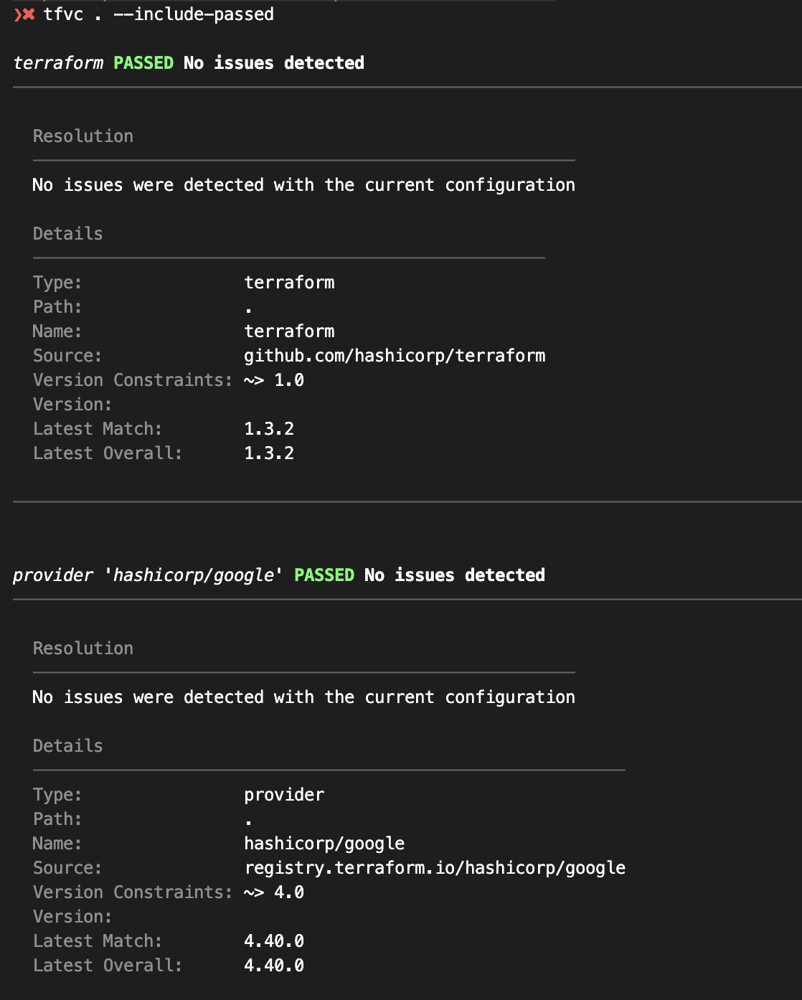

# Basic Usage


## Prerequisutes

This basic example assumes that you have a `main.tf` file in your current working directory configuring a version constraint for
Terraform itself and two required providers, `google` and `aws`. For example:

``` terraform title="./main.tf"
terraform {
  required_version = "~> 1.0"

  required_providers {
    aws = {
      source  = "hashicorp/aws"
      version = "~> 3.0"
    }
    google = {
      source  = "hashicorp/google"
      version = "~> 4.0"
    }
  }
}
```

## Running tfvc

`tfvc` can be invoked for the current working directory using the following command.

``` bash
tfvc .
```

And you should see output similar to the following.


## Examining the output

Looking at the output in this example you can see that `tfvc` is failing because the `hashicorp/aws` provider is configured to use an outdated major version.

In `main.tf` the `aws` provider version constraint is set to `~> 3.0` allowing any version matching `3.x.x` to be installed. However, `tfvc` found a newer major version (`4.34.0`) available in the Terraform Registry for this provider so raised this issue.

## Display all checks including passes

To display all checks in the console output you simply need to append the `--include-passed` or `-a` parameter when running `tfvc`, for example:

``` bash
tfvc . --include-passed
```

Which should produce output similar to the following for this example.




